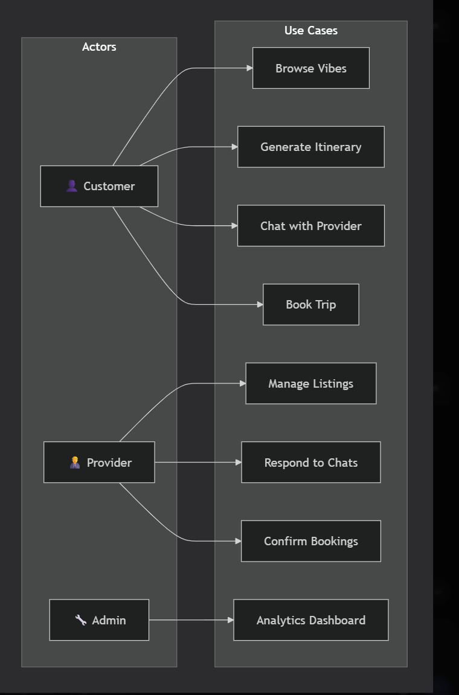
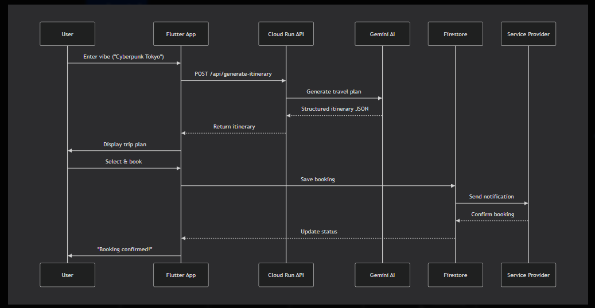
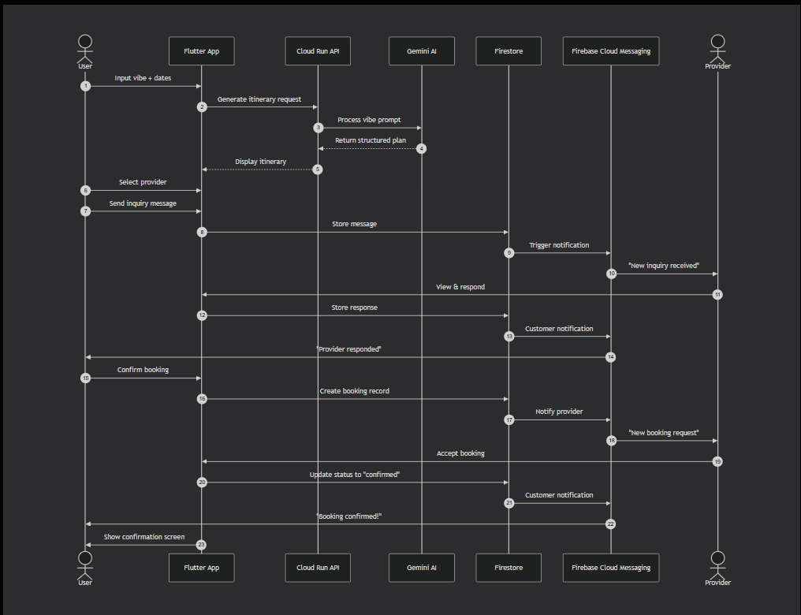
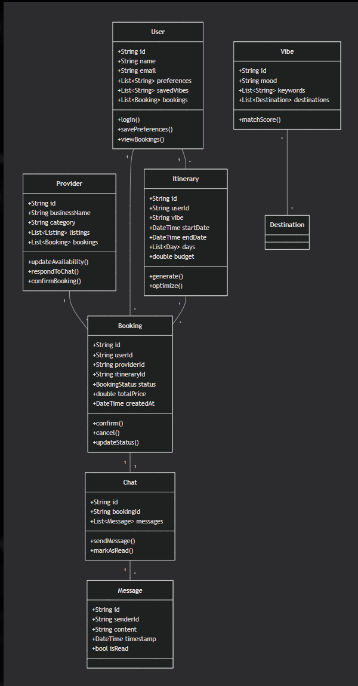

# 🌍 Vibe Trip Agent

### *One vibe in. One tap. Full trip.*

**Vibe Trip Agent** is an AI-powered travel planning assistant that transforms a simple "vibe" into a comprehensive, multi-day itinerary. By bridging the gap between inspiration and logistics, it handles flights, stays, transit, and dining recommendations in a single, fluid experience.

[](https://play.google.com/store)
[](https://apps.microsoft.com)
[](https://flutter.dev)
[](https://cloud.google.com/run)
[](https://deepmind.google/technologies/gemini/)
[](https://opensource.org/licenses/MIT)

---


## 🚀 Overview

Traditional travel planning is fragmented across dozens of tabs, apps, and booking sites. **Vibe Trip Agent** simplifies this by using **Generative AI** to process a user's mood, budget, and travel dates into a structured, actionable plan.

Designed for speed and a premium user experience, Vibe Trip Agent serves as a **personal concierge in your pocket** — available on Android and Windows, powered by scalable Google Cloud infrastructure.

### Key Metrics
- ⚡ **5-second** itinerary generation
- 🌍 **150+** destinations covered
- 💬 **Real-time** chat with providers
- 📱 **Cross-platform** support

---

## ❗ Problem Statement

Traditional travel platforms suffer from:

| Problem | Impact |
|---------|--------|
| **Generic, non-personalized recommendations** | Wasted time, irrelevant suggestions |
| **Fragmented booking processes** | Users leave platform to book elsewhere |
| **Lack of real-time interaction with providers** | Delayed responses, missed opportunities |
| **Static listings without contextual matching** | No "vibe" or mood-based discovery |
| **Information overload** | Decision paralysis |

---

## 💡 Solution

Vibe Trip Agent solves these problems with:

| Solution | Benefit |
|----------|---------|
| **AI-powered vibe matching** | Personalized recommendations in seconds |
| **Unified booking interface** | End-to-end trip planning without leaving app |
| **Real-time chat with providers** | Instant negotiation and confirmation |
| **Dynamic, contextual recommendations** | "Vibe in, trip out" — no manual searching |
| **Smart itinerary generation** | Structured plans with flights, stays, transit, dining |

---

## 🧠 Core Features

### ✨ 1. Vibe-Based Travel Discovery
- Users select or input their mood (e.g., "adventure", "luxury", "chill", "cyberpunk")
- Intelligent recommendation engine suggests destinations & experiences
- Real-time vibe validation against current travel trends

### 💬 2. Real-Time Chat System
- Direct communication between customers and providers
- Instant negotiation, inquiry, and booking confirmation
- Typing indicators, read receipts, message history

### 📅 3. Booking Management
- End-to-end booking workflow (search → select → book → confirm)
- Status tracking: Pending → Confirmed → Completed → Cancelled
- Calendar integration and reminders

### 👤 4. User Profiles
- Personalized preferences and saved vibes
- Travel history and past itineraries
- Favorite destinations and providers

### 🧑‍💼 5. Provider Dashboard
- Manage listings, availability, and pricing
- Respond to customer inquiries in real-time
- Analytics and booking insights

### 🔔 6. Smart Notifications
- Booking confirmations and updates
- New chat messages
- Personalized recommendations based on saved vibes
- Price drop alerts

### 🤖 7. AI Itinerary Generation
- Natural language vibe input
- Structured day-by-day plans
- Flight, hotel, transit, and dining suggestions
- Budget optimization

---

## 🏗️ Tech Stack

### 📱 Frontend
| Technology | Purpose |
|------------|---------|
| **Flutter 3.16+** | Cross-platform UI framework |
| **Dart** | Programming language |
| **Riverpod** | State management |
| **GoRouter** | Navigation & routing |
| **Material 3** | UI components & theming |

### ☁️ Backend & Infrastructure
| Technology | Purpose |
|------------|---------|
| **Google Cloud Run** | Serverless containerized backend |
| **Cloud Firestore** | Real-time NoSQL database |
| **Firebase Authentication** | User management & security |
| **Firebase Cloud Messaging** | Push notifications |
| **Cloud Storage** | Media & file storage |
| **Cloud Functions** | Serverless event-driven logic |

### 🧠 AI & Intelligence
| Technology | Purpose |
|------------|---------|
| **Google Gemini API** | Itinerary generation & vibe matching |
| **OpenAI GPT (fallback)** | Natural language processing |
| **Custom recommendation engine** | Destination matching |

### 🌐 Hosting & Deployment
| Platform | Purpose |
|----------|---------|
| **Google Cloud Platform** | Primary cloud infrastructure |
| **cPanel** | Static asset hosting |
| **GitHub Actions** | CI/CD pipeline |

---
## UML Diagrams

## Use Case Diagram

## Data Flow  Diagram

## Sequence Diagram

## Class Diagram

## 🧩 System Architecture


```mermaid
graph TB
    subgraph "Client Layer"
        A[Flutter App - Android] 
        B[Flutter App - Windows]
    end
    
    subgraph "Google Cloud Platform"
        C[Cloud Run - Backend API]
        D[Firebase Auth]
        E[Cloud Firestore]
        F[Cloud Storage]
        G[Cloud Functions]
    end
    
    subgraph "AI Layer"
        H[Google Gemini API]
        I[OpenAI GPT]
    end
    
    subgraph "External Services"
        J[Flight APIs]
        K[Hotel APIs]
        L[Payment Gateways]
    end
    
    A --> C
    B --> C
    A --> D
    B --> D
    C --> E
    C --> F
    C --> G
    C --> H
    C --> I
    C --> J
    C --> K
    C --> L
    E --> A
    E --> B


